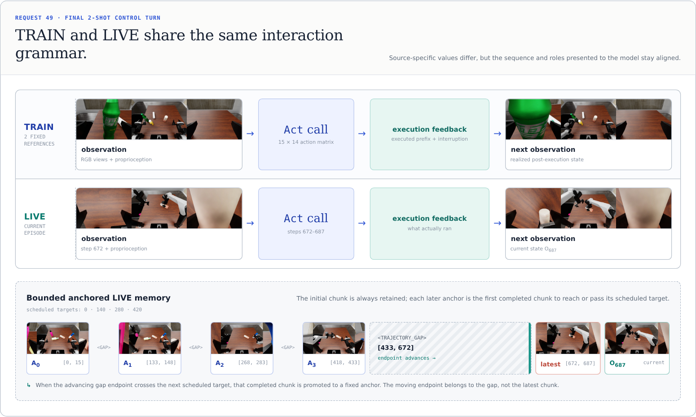
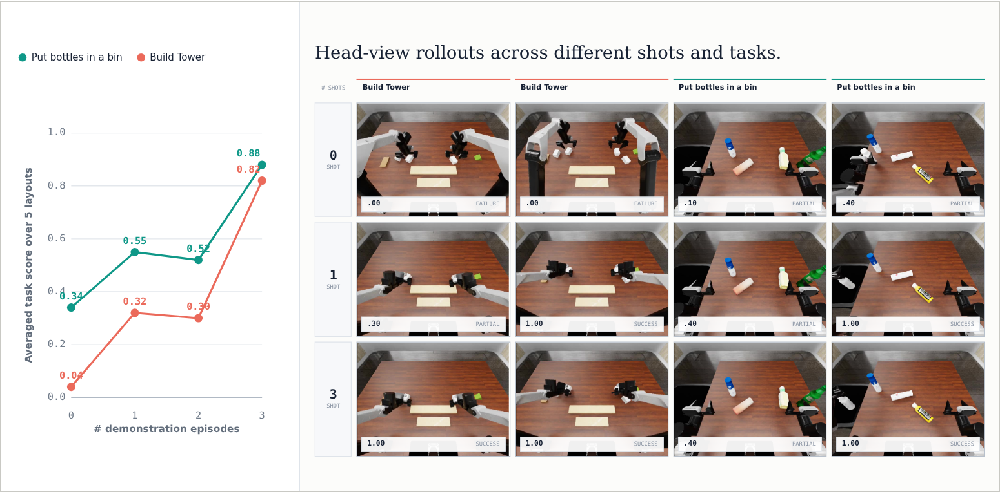
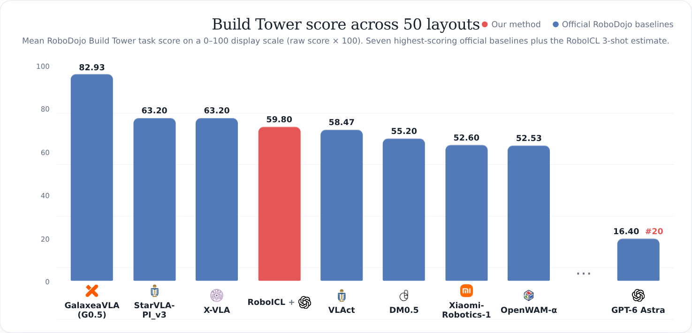

<h1 align="center">RoboICL: Embodied In-Context Learning for GPT-6 Astra</h1>

<p align="center"><strong>Multimodal Models as Few-Shot Robot Learners</strong></p>

<p align="center">
  <a href="https://mosi-ai.github.io/RoboICL-GPT6-Astra.github.io/">Project Page</a>
  &nbsp;·&nbsp;
  <a href="./put_bottles_l3_2shot_final_gpt6_request.zip">Request Example</a>
</p>

RoboICL enables a general-purpose multimodal model to adapt to bimanual robot manipulation tasks at inference time from a small number of executable demonstrations. GPT-6 Astra directly generates low-level Cartesian action sequences through a single `Act` interface; a deterministic harness validates and executes them.

## Overview

RoboICL presents reference trajectories and deployment interactions in the same execution-grounded grammar:

```text
observation → Act call → execution feedback → next observation
```



The framework has three defining properties:

- **Direct action generation.** GPT-6 Astra is the sole learned action generator and predicts 15-step dual-arm Cartesian action sequences.
- **Execution-grounded demonstrations.** TRAIN examples use the same observation–action–feedback structure that recurs during LIVE control.
- **Bounded anchored LIVE memory.** Selected full-resolution interaction chunks remain available across long episodes, while omitted intervals are marked explicitly.

## Results

### Few-shot scaling



Across five fixed layouts per task, three demonstrations raise the mean task score:

- *Put bottles in a bin*: **0.34 → 0.88**
- *Build Tower*: **0.04 → 0.82**

### Build Tower across 50 layouts



In a separate seed-0 sweep over 50 *Build Tower* layouts, RoboICL 3-shot reaches a mean score of **59.80** and ranks **4th** among the plotted entries, compared with **16.40** and rank **20th** for GPT-6 Astra Direct.

## Released request example

[`put_bottles_l3_2shot_final_gpt6_request.zip`](./put_bottles_l3_2shot_final_gpt6_request.zip) contains the fully serialized final model request from a 2-shot *Put bottles in a bin* rollout at control step 687—the request visualized in the framework figure above.

It contains:

- the task and controller instructions;
- the `Act` tool schema;
- two fixed TRAIN reference trajectories;
- bounded anchored LIVE interaction history;
- robot proprioception and 30 embedded three-view RGB observations;
- 15 preceding `Act` calls and their execution feedback.

The RGB observations are embedded as JPEG data URLs, making the request self-contained. Reward values, success labels, evaluator metrics, privileged object state, task code, and layout metadata are not included in the action-generation request.

Extract and validate the JSON locally:

```bash
unzip put_bottles_l3_2shot_final_gpt6_request.zip
python -m json.tool put_bottles_l3_2shot_final_gpt6_request.json > /dev/null
```

SHA-256 of the extracted JSON:

```text
7041a9c725d98a47f279dd721188573bceabb33a8b5dfe4072888ae370b27fee
```
