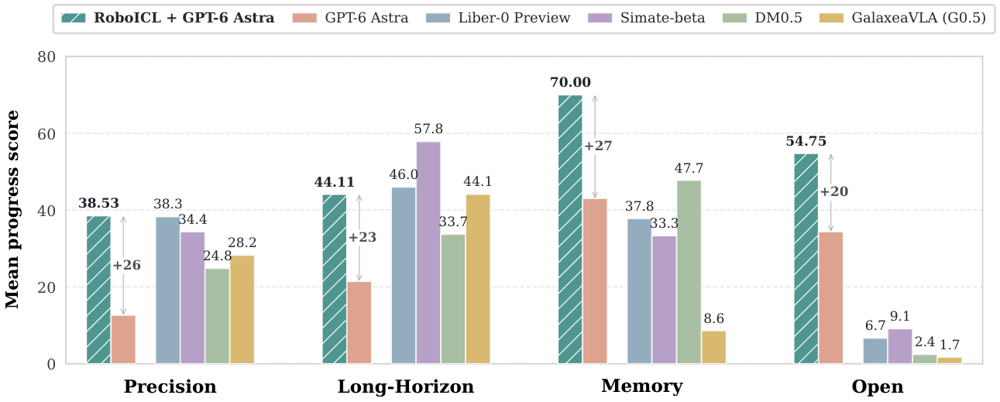

<h1 align="center">RoboICL: Embodied In-Context Learning with GPT-6 Astra</h1>

<p align="center"><em>Multimodal Models as Few-Shot Robot Learners</em></p>

<p align="center">
  <a href="https://arxiv.org/abs/2609.34261"></a>
  <a href="https://mosi-ai.github.io/RoboICL-GPT6-Astra.github.io/"></a>
  <a href="https://mosi-ai.github.io/RoboICL-GPT6-Astra.github.io/#results-and-episodes"></a>
</p>

<p align="center">
  <a href="https://mosi-ai.github.io/RoboICL-GPT6-Astra.github.io/">
    
  </a>
</p>

<p align="center"><em>RoboDojo category-level comparison. RoboICL uses interaction memory alone on Open and one demonstration on the other categories.</em></p>

## News

- **2026-09-29** Paper released on arXiv, together with the code and 800+ interactive evaluation rollouts.
- **2026-09-19** Research Preview launched.

## Overview

RoboICL is an in-context robot-control framework that adapts a frozen
general-purpose vision-language model from demonstrations and its own execution
history. It requires no robot-specific parameter update and no learned
vision-language-action model.

RoboICL separates context into two complementary sources:

- **Demonstration context** provides recorded robot trajectories as executable
  few-shot examples.
- **Interaction memory** retains the model's own actions, controller feedback,
  and resulting observations during the current rollout.
- **A shared interaction grammar** presents both sources as
  `observation -> action -> receipt -> observation` records.
- **Bounded anchored memory** preserves selected early and intermediate
  interactions while retaining the latest result for immediate correction.

The released runner connects GPT-6 Astra to RoboDojo through one validated
action interface. At each request, the model observes a triptych of the left
wrist, head, and right wrist cameras together with robot proprioception, then
predicts a bounded sequence of dual-arm Cartesian actions for closed-loop
execution.


## Installation

### Prerequisites

- Linux with an NVIDIA GPU and a working Vulkan/CUDA stack
- Git and Git LFS
- an Isaac Sim 5.1-compatible simulator environment
- a separate Python environment for the multimodal policy process

The simulator and policy processes intentionally use separate interpreters
because their `websockets` and simulator dependency constraints differ.

### Clone the repository

```bash
git clone --recurse-submodules https://github.com/Mosi-AI/RoboICL.git
cd RoboICL
```

For an existing clone:

```bash
git submodule update --init --recursive
```

The exact supported commits of RoboDojo, XPolicyLab, IsaacLab, and cuRobo are
recorded in `configs/upstream.lock.json` and verified before launch.

### Configure the two Python environments

Point RoboICL at the interpreters that contain your simulator and policy
dependencies:

```bash
export ROBOICL_SIM_PYTHON=/path/to/sim/bin/python
export ROBOICL_POLICY_PYTHON=/path/to/policy/bin/python
export ROBOICL_DATA_ROOT="$PWD/data"
export ROBOICL_RESULTS_ROOT="$PWD/results"
source setup/paths.sh
```

Install the direct RoboICL dependencies into those environments after the
Isaac Sim environment itself is available:

```bash
"$ROBOICL_POLICY_PYTHON" -m pip install -r setup/requirements-policy.txt
"$ROBOICL_SIM_PYTHON" -m pip install \
  -r setup/requirements-sim.txt \
  -c setup/constraints-sim.txt
```

If the simulator environment provides a newer `libstdc++` than the host:

```bash
SIM_PREFIX="$(dirname -- "$(dirname -- "$ROBOICL_SIM_PYTHON")")"
export ROBOICL_SIM_LD_PRELOAD="$SIM_PREFIX/lib/libstdc++.so.6"
```

## Data preparation

### RoboDojo assets

Fetch the complete frozen RoboDojo asset tree into an external Git/LFS cache.
The script checks out the revision in `configs/data.lock.json`, verifies the
download, and links `data/Assets` to the cache.

```bash
"$ROBOICL_POLICY_PYTHON" setup/fetch_assets.py \
  --data-root "$ROBOICL_DATA_ROOT" \
  --cache /path/to/robodojo-data-cache
```

### One-shot references

Fetch and deterministically build either published one-shot reference:

```bash
"$ROBOICL_POLICY_PYTHON" setup/fetch_reference.py deposit_coin \
  --data-root "$ROBOICL_DATA_ROOT"

"$ROBOICL_POLICY_PYTHON" setup/fetch_reference.py fill_pen_holder \
  --data-root "$ROBOICL_DATA_ROOT"
```

Each source episode is checked against `configs/reference_sources.lock.json`.
The generated reference bundle contains 12 non-overlapping action blocks and
their starting/result observations.

To build a reference for another task from a local HDF5 episode:

```bash
"$ROBOICL_POLICY_PYTHON" -m roboicl.reference build \
  --task "$TASK" \
  --source "$ROBOICL_DATA_ROOT/runtime-data/$TASK/train/episode_0000000.hdf5" \
  --source-id "runtime-data/$TASK/train/episode_0000000.hdf5" \
  --source-sha256 "$SOURCE_SHA256" \
  --output "$ROBOICL_DATA_ROOT/runtime-data/$TASK/reference_1shot_train12_endpoint_h$H" \
  --horizon "$H" \
  --chunks 12
```

## Run RoboICL

The release provides two main protocols:

| Protocol | Demonstrations | TRAIN blocks `J` | LIVE memory blocks `B` |
|---|---:|---:|---:|
| `configs/protocols/zero_shot_b25.json` | 0 | 0 | 25 |
| `configs/protocols/one_shot_j12_b12.json` | 1 | 12 | 12 |

Both use the task-adaptive action horizons in
`configs/adaptive_horizons.json`.

### 1. Preflight without an API request

```bash
"$ROBOICL_POLICY_PYTHON" -m roboicl.run deposit_coin \
  --shots 0 \
  --seed 0 \
  --layout 0 \
  --profile configs/protocols/zero_shot_b25.json \
  --dry-run
```

This validates the task, layout, assets, profile, interpreters, and pinned
submodules without starting the simulator or calling the model API.

### 2. Validate the simulator and cameras

```bash
"$ROBOICL_POLICY_PYTHON" -m roboicl.run deposit_coin \
  --shots 0 \
  --seed 0 \
  --layout 0 \
  --gpu 0 \
  --profile configs/protocols/zero_shot_b25.json \
  --capture-only
```

`--capture-only` launches the scene and verifies the three RGB streams without
making a model request or executing an action.

### 3. Run a scored zero-shot rollout

```bash
export ASTRA_API_KEY=...

"$ROBOICL_POLICY_PYTHON" -m roboicl.run deposit_coin \
  --shots 0 \
  --seed 0 \
  --layout 0 \
  --gpu 0 \
  --profile configs/protocols/zero_shot_b25.json
```

### 4. Run a scored one-shot rollout

```bash
export ASTRA_API_KEY=...

"$ROBOICL_POLICY_PYTHON" -m roboicl.run deposit_coin \
  --shots 1 \
  --seed 0 \
  --layout 0 \
  --gpu 0 \
  --profile configs/protocols/one_shot_j12_b12.json
```

Replace the task, seed, and layout as needed. Use `--reference /path/to/bundle`
for a one-shot task without a published reference path. A process exit code of
zero means evaluation completed; task success and progress are reported by the
native RoboDojo evaluator in the generated `result.json`.


## Repository layout

```text
roboicl/
├── run.py                 preflight and process orchestration
├── robodojo.py            single-layout RoboDojo adapter
├── rollout.py             observation/action execution loop
├── policy_server.py       XPolicyLab WebSocket policy entrypoint
├── reference.py           reference builder and verifier
└── policy/                prompting, memory, validation, and transport
configs/
├── protocols/             zero-shot and one-shot protocol profiles
├── tasks/                 official documentation for 42 tasks
├── adaptive_horizons.json task-specific action horizons
├── data.lock.json         frozen asset revision
├── reference_sources.lock.json
└── upstream.lock.json     pinned submodule commits
setup/
├── fetch_assets.py
├── fetch_reference.py
├── requirements-policy.txt
├── requirements-sim.txt
└── paths.sh
third_party/
├── RoboDojo/
├── XPolicyLab/
├── IsaacLab/
└── curobo/
```

## Citation

```bibtex
@article{liu2026roboicl,
  title   = {RoboICL: Embodied In-Context Learning with GPT-6 Astra},
  author  = {Liu, Fangcheng and Shen, Yeqing and Cheng, Anda and Mi, Weishi and
             Tang, Chao and Liu, Chenyuan and Xiang, Yushun and Li, Tingguang and
             Li, Yong-Lu and Tang, Yehui},
  journal = {arXiv preprint arXiv:2609.34261},
  year    = {2026},
  eprint  = {2609.34261},
  archivePrefix = {arXiv},
  url     = {https://arxiv.org/abs/2609.34261}
}
```

## License

RoboICL's project-owned code is released under the [MIT License](LICENSE).
Third-party submodules and benchmark assets retain their original licenses and
terms.
